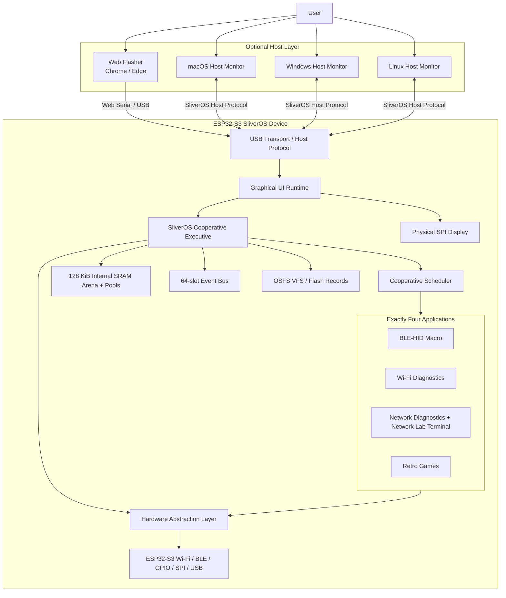
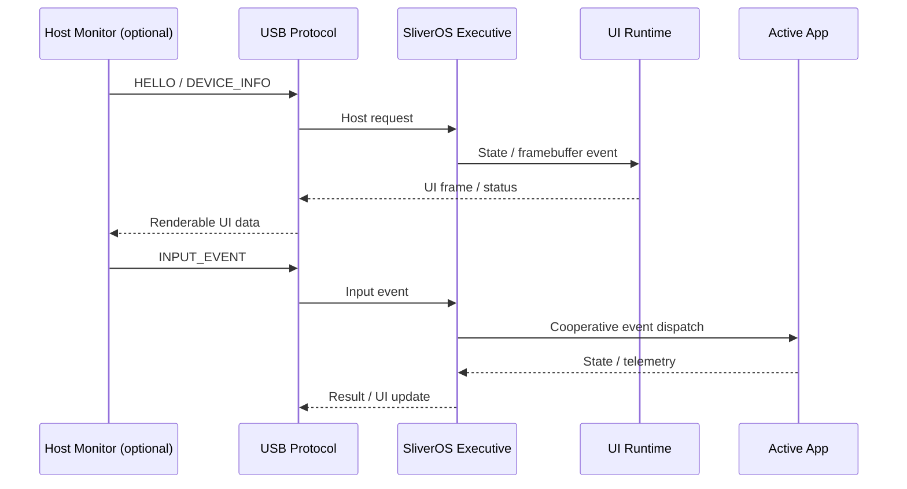
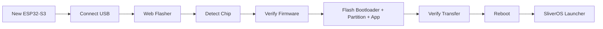

# SliverOS

**SliverOS is a custom cooperative embedded OS executive for the ESP32-S3, running on top of the ESP-IDF runtime and FreeRTOS infrastructure.** It provides a graphical launcher, four application modules, a browser-based beginner-friendly firmware installer, and a planned cross-platform host monitor for macOS, Windows, and Linux.

> **Architecture terminology:** SliverOS is an embedded OS executive / microkernel-inspired executive. It is not a bare-metal replacement for the ESP-IDF runtime and it is not a Linux-style MMU/process-isolated microkernel.

## 🚀 Live Web Flasher

**[Install SliverOS](https://sliver-o232adi1r-bishwajit5788.vercel.app/)**

The Web Flasher is designed for beginners: connect an ESP32-S3 by USB, detect the device, install the compatible release, verify the transfer, and reboot into SliverOS.

Deployment details: [`VERCEL.md`](./VERCEL.md)

---

## 🎯 Project Vision

The goal is to turn an ESP32-S3 into a portable, self-contained embedded computing platform whose core execution remains on the ESP32-S3.

The ESP32-S3 is the computer running SliverOS. A physical SPI display can provide local UI, while an optional **SliverOS Host Monitor** can provide a larger display, keyboard/input bridge, telemetry, and development console from **macOS, Windows, or Linux**.

The host computer is optional; SliverOS must not depend on a desktop OS to boot or execute its four applications.

---

## 🏗️ System Design

GitHub renders Mermaid diagrams directly in Markdown, making the architecture easy to keep alongside the code and documentation. citeturn0search4



### Runtime model



---

## 🧠 Kernel & Runtime

- **Cooperative application execution:** SliverOS owns application dispatch; application modules do not get independent FreeRTOS tasks.
- **Scheduler:** priority → period eligibility → equal-priority round-robin, with execution telemetry and watchdog/liveness integration.
- **No-blocking application contract:** cooperative application paths must not perform unbounded blocking I/O or sleep while holding OS execution time.
- **Memory:** a statically reserved 128 KiB internal-SRAM arena plus fixed-size pools for deterministic kernel/application allocations.
- **Event bus:** bounded static event transport between callbacks/interrupt-facing HAL code and cooperative execution.
- **Fault manager:** bounded fault history with recovery-oriented state transitions.

## 💾 Memory Model

```text
ESP32-S3
├── Internal SRAM
│   ├── SliverOS kernel state
│   ├── TCBs / scheduler data
│   ├── 128 KiB static arena
│   ├── fixed-size pools
│   ├── event/fault structures
│   └── critical runtime data
│
├── PSRAM (target configuration: 8 MiB)
│   ├── framebuffer storage
│   └── non-critical graphics/game assets
│
└── Flash (target configuration: 8 MiB)
    ├── bootloader
    ├── partition table
    ├── OTA application slots
    └── OSFS storage partition
```

Memory placement is treated as an implementation invariant and should be verified from the linker/map output rather than inferred only from source declarations.

---

## 🖥️ Graphical SliverOS UI

SliverOS is designed around a graphical launcher rather than a traditional text-only CLI.

The launcher exposes exactly four application modules:

1. **BLE-HID Macro** — BLE keyboard emulation and VFS-backed macro playback.
2. **Wi-Fi Diagnostics** — passive Wi-Fi frame metadata auditing such as channel, RSSI, frame type/subtype, timestamp, and length. **No PMKID or credential harvesting.**
3. **Network Diagnostics** — authorized local-network reachability and service diagnostics, with a safe terminal-style **Network Lab** interface.
4. **Retro Games** — low-priority graphics/game runtime using cooperative input and rendering.

The physical display remains the local UI. The future Host Monitor can mirror/control the same UI over USB without becoming the machine that runs the OS.

---

## 🔎 Network Lab Terminal

The Network Diagnostics application now includes a bounded command-parser foundation for a terminal-style interface.

Supported command families are intentionally scoped to authorized diagnostics:

```text
help
status
wifi scan
network scan <authorized CIDR/target>
port check <authorized host> <port>
clear
```

The parser explicitly blocks credential harvesting, PMKID capture, deauthentication, brute force, exploitation, and unrestricted attack commands.

The terminal is intended to grow into a cooperative, non-blocking **Network Security Lab** with Wi-Fi metadata scanning, local host discovery, ICMP reachability, and bounded TCP service checks. It is not intended to become an unrestricted attack framework.

> **Implementation status:** the parser and command contract are present. Hardware-backed Wi-Fi scanning and broader network discovery still require integration and physical validation.

---

## 🖥️ Cross-Platform SliverOS Host Monitor — Planned

A separate desktop companion is planned for:

- **macOS**
- **Windows**
- **Linux**

The Host Monitor will communicate with SliverOS over a defined USB protocol rather than parsing arbitrary serial log text.

Planned protocol messages include:

```text
HELLO
DEVICE_INFO
SYSTEM_STATUS
APP_STATUS
UI_FRAME
INPUT_EVENT
LOG_EVENT
COMMAND
ACK
```

Planned host capabilities:

- Large-screen SliverOS UI
- Keyboard/input forwarding
- System telemetry
- Application status
- Logs and diagnostics
- Network Lab terminal interface
- Developer tooling

Recommended implementation direction: a cross-platform native shell such as **Tauri 2** with a TypeScript UI and a native transport layer. The host monitor remains optional and must never be required for the ESP32-S3 to boot.

---

## 🌐 Web Flasher

The Web Flasher is a separate beginner-oriented installation tool.



The browser should hide low-level details such as flash offsets and transport parameters from beginners. Advanced diagnostics can remain available in developer mode.

The release system distinguishes:

- **SHA-256:** firmware integrity verification in the browser.
- **Transport/device checks:** flashing-protocol verification.
- **Future cryptographic signing:** authenticity/trust, which is a separate security mechanism.

Live installer: **https://sliver-o232adi1r-bishwajit5788.vercel.app/**

---

## 📁 Repository Structure

```text
SliverOS/
├── os/
│   ├── main/                     # Boot orchestration
│   ├── kernel/                   # Executive, scheduler, memory, events, faults
│   ├── hal/                      # Hardware abstraction layer
│   ├── vfs/                      # OSFS storage and audit logging
│   ├── ui/                       # Graphical runtime and launcher
│   └── apps/
│       ├── ble_hid/              # BLE-HID macro engine
│       ├── wifi_diagnostics/     # Passive Wi-Fi metadata diagnostics
│       ├── network_diagnostics/  # Network diagnostics + terminal parser
│       └── retro_games/          # Retro game runtime
│
├── flasher/                      # Vite + Web Serial installer
├── tests/                        # Host-native unit tests
├── tools/                        # Build/layout verification utilities
├── scripts/                      # Firmware packaging
├── docs/                         # Architecture and hardware documentation
└── .github/workflows/            # CI workflows
```

---

## 🧪 Development & Verification

### Host tests

```bash
make -C tests
```

### Web Flasher

```bash
cd flasher
npm test
npm run build
npm run dev
```

Use Chrome or Microsoft Edge for Web Serial testing.

### ESP32-S3 firmware

Build using the repository's ESP-IDF configuration and verify the generated bootloader, partition table, application image, map file, memory placement, and OTA sizing before treating a build as release-ready.

---

## 🔐 Safety & Scope

SliverOS is intended for embedded development, authorized diagnostics, defensive security learning, and controlled lab environments.

The network tooling is deliberately bounded. It does not include PMKID/credential harvesting, password cracking, deauthentication, exploitation automation, or unrestricted attack functionality.

---

## 📊 Project Status

| Area | Status |
|---|---|
| ESP32-S3 architecture | 🟢 Defined |
| Cooperative executive | 🟢 Implemented / hardened in stages |
| Graphical launcher | 🟢 Implemented |
| Four-application model | 🟢 Defined |
| Wi-Fi metadata diagnostics | 🟢 Scoped / implemented in stages |
| Network diagnostics | 🟡 Hardware validation required |
| Network Lab terminal parser | 🟢 Foundation added |
| Web Flasher | 🟡 Online; physical flashing validation required |
| Cross-platform Host Monitor | 🟡 Planned architecture |
| Physical hardware validation | 🔴 Must be performed on actual ESP32-S3 hardware |
| Release readiness | 🔴 Not ready until mandatory CI and hardware gates pass |

---

## 📚 Documentation

- [`docs/ARCHITECTURE_ENFORCEMENT.md`](./docs/ARCHITECTURE_ENFORCEMENT.md) — architecture invariants and release gates
- [`docs/HARDWARE_VALIDATION.md`](./docs/HARDWARE_VALIDATION.md) — physical ESP32-S3 validation matrix
- [`VERCEL.md`](./VERCEL.md) — Web Flasher deployment and beginner installation flow

## License

See the repository license and project documentation for current licensing information.
