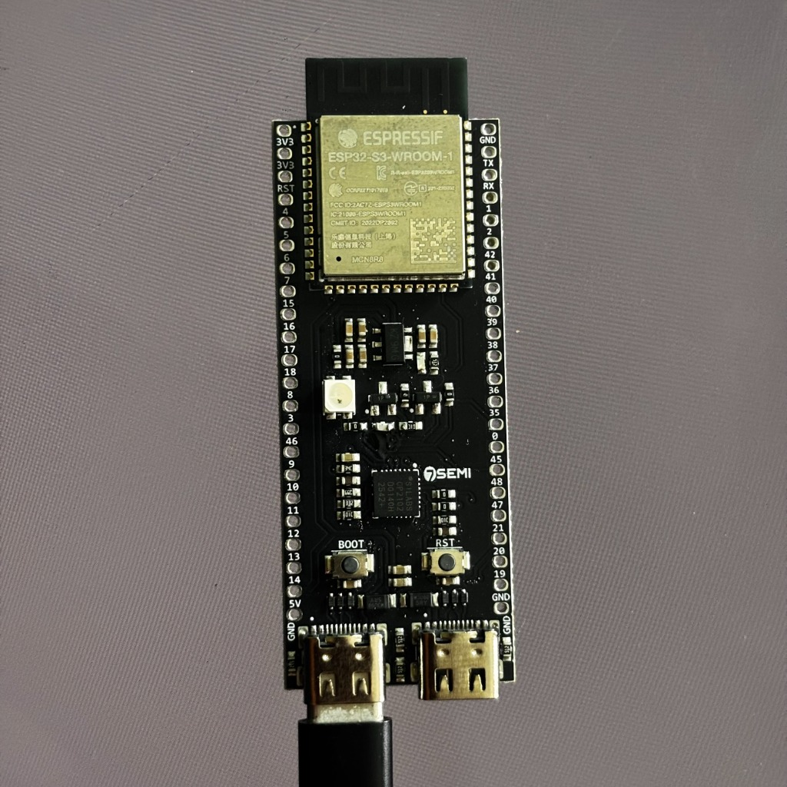
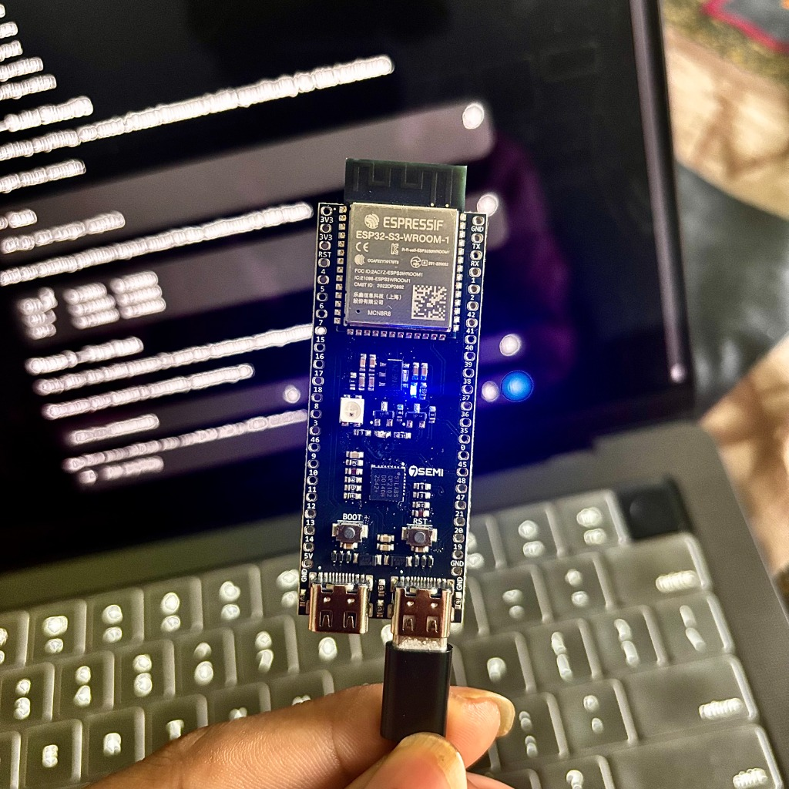
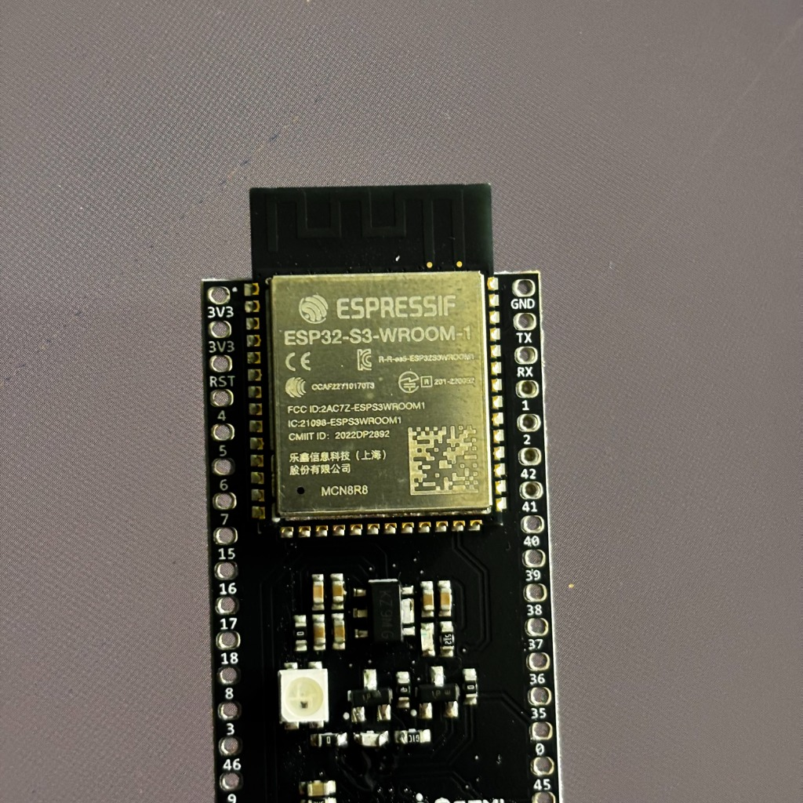
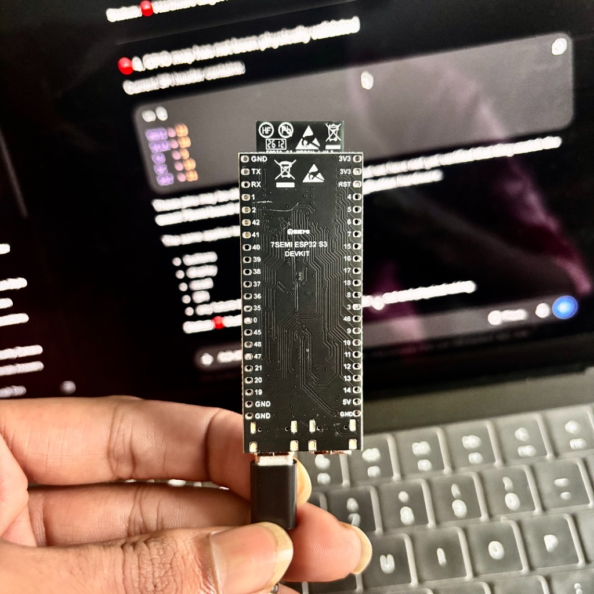

# SliverOS

A **Custom Cooperative Embedded OS Runtime Executive for ESP32-S3 built on ESP-IDF**, paired with a **Vercel-Hosted Web Serial Desktop Host**.

Target Hardware: **7Semi ESP32-S3-Dev-BoardC-1U-N8R8**
- **Silicon**: Espressif ESP32-S3 (Xtensa 32-bit dual-core LX7 @ 240 MHz)
- **Module**: ESP32-S3-WROOM-1 MCN8R8
- **Flash**: 8 MB Quad/Octal SPI Flash (DIO, 80 MHz)
- **PSRAM**: 8 MB Octal SPI External RAM (`CONFIG_SPIRAM_MODE_OCT=y`)
- **Native USB**: Hardware USB Serial/JTAG Controller connected via onboard USB-C port (`/dev/cu.usbmodem101` on macOS)
- **Display Hardware**: **None**. The Mac browser serves as the graphical display and host interface over Web Serial.

---

## 1. System Architecture

```text
ESP32-S3 (7Semi N8R8)
         ↓
  SliverOS Runtime (Cooperative Scheduler, Memory Arenas, VFS, Apps)
         ↓
  SLVR/1 Host Protocol (CRC-16-CCITT Framed Duplex Stream)
         ↓
  Native USB Serial/JTAG Controller (/dev/cu.usbmodem101)
         ↓
  Web Serial API (Chromium / Google Chrome on macOS)
         ↓
  SliverOS Web Host (Glassmorphic Desktop Interface)
         ↓
     Mac Display
```

### ESP32-S3 Responsibilities:
- SliverOS kernel and cooperative single-threaded task scheduler.
- Task control blocks and deterministic execution budget auditing.
- Memory management: 128 KiB internal SRAM static arena, fixed memory pools (16B, 64B, 256B).
- Power-loss safe block-based VFS (`osfs`) with atomic commit markers.
- Decoupled kernel event bus (64-slot ring buffer).
- Bluetooth LE HID keyboard emulation and macro parser.
- Wi-Fi passive metadata diagnostics (strictly no credential/PMKID harvesting).
- Network diagnostic state machine (real bounded ICMP & TCP port probes; no fabricated values).
- Retro games engine (Space Micro-Lander physics, fuel, gravity, and collision simulation @ 60 Hz).
- SLVR/1 binary protocol service, command dispatcher, and telemetry stream.
- Fault auditing and hardware Task Watchdog Timer (TWDT) recovery.

### Mac Browser Responsibilities:
- Graphical desktop interface with floating application windows and taskbar.
- 60 FPS HTML5 Canvas vector renderer for Space Micro-Lander.
- Interactive Developer Terminal (`root@sliver:~#`) with controlled commands.
- Real-time Device Monitor (CPU usage, scheduler tick, arena/PSRAM memory, VFS storage).
- Official ESP32-S3 ROM bootloader firmware flasher with SHA-256 pre-verification.
- Built-in In-Browser Hardware Simulator (`SIMULATED DEVICE` mode) for off-hardware testing.

---

## 2. The Four Applications

1. **BLE-HID Macro**:
   - Runs on ESP32-S3: parses macro scripts stored in VFS, outputs Bluetooth LE HID reports.
   - Web Host displays macro listings, execution logs, and trigger buttons.
2. **Wi-Fi Diagnostics**:
   - Runs on ESP32-S3: passive promiscuous frame metadata classification (beacons, probe requests, data traffic).
   - Strictly passive; no PMKID extraction, deauthentication, or password harvesting.
3. **Network Diagnostics**:
   - Runs on ESP32-S3: authorized local ICMP reachability checks and TCP port probes (22, 80, 443).
   - Reports real measured network latency (zero fabricated metrics).
4. **Retro Games (Space Micro-Lander)**:
   - Runs on ESP32-S3: fixed-point physics, thruster simulation, fuel consumption, and collision detection.
   - Streams compact `SLVR_MSG_GAME_STATE` frames to Web Host.
   - Web Host renders smooth 60 FPS vector visuals on HTML5 Canvas.

---

## 3. Directory Structure

```text
microkernel-esp32/
├── CMakeLists.txt              # ESP-IDF Root CMake build configuration
├── sdkconfig.defaults          # ESP32-S3 8MB Flash & Octal PSRAM configuration
├── partitions.csv              # 8MB Flash layout with A/B OTA & 2.6MB osfs
├── os/
│   ├── main/main.c             # Boot orchestrator & task registration
│   ├── kernel/                 # Executive, scheduler, arena, pools, event bus, faults
│   ├── hal/                    # Hardware Abstraction Layer (timer, GPIO, Wi-Fi, BLE)
│   ├── vfs/                    # Block storage layer, wear-leveling, commit markers
│   ├── protocol/               # SLVR/1 binary framing encoder/decoder & USB service
│   └── apps/
│       ├── ble_hid/            # App 0: BLE Keyboard & Macro Parser
│       ├── wifi_diagnostics/   # App 1: Passive 802.11 Frame Auditor
│       ├── network_diagnostics/# App 2: Non-blocking Port/Ping State Machine
│       └── retro_games/        # App 3: Space Micro-Lander Game Engine
├── flasher/                    # Web Host desktop interface, simulator, flasher
│   ├── src/
│   │   ├── protocol/           # SLVR/1 JS protocol parser, client, and simulator
│   │   ├── ui/                 # HTML5 Canvas vector game renderer
│   │   ├── flashing/           # Bootloader flash manager and firmware verification
│   │   ├── serial/             # Web Serial API driver
│   │   └── main.js             # Web Host master desktop orchestrator
│   └── test/                   # Web Host protocol and manifest unit tests
├── tests/                      # 12 host-native C unit test suites
└── docs/                       # Architectural and hardware specifications
    ├── ARCHITECTURE.md         # Full system architecture
    ├── HOST_PROTOCOL.md        # SLVR/1 binary protocol specification
    ├── WEB_HOST.md             # Web Host desktop and simulator details
    ├── HARDWARE_VALIDATION.md  # 25-point hardware test matrix
    ├── BUILD.md                # Build instructions for firmware, tests, web
    ├── FLASHING.md             # Firmware flashing guide
    └── TROUBLESHOOTING.md      # Hardware and connection troubleshooting
```

---

## 4. Verification & Testing

### Host-Native C Test Suite (12 Suites, 100% Pass Rate):
```bash
make -C tests clean
make -C tests
```
Runs: Memory Manager, Fixed Pools, Event Bus, Cooperative Scheduler, State Machine, Macro Parser, VFS Block Storage, VFS Power-Loss Safe Recovery, Wi-Fi Metadata Classifier, Network Diagnostics State Machine, Space Micro-Lander Physics, and SLVR/1 Protocol (including 200,000-iteration parser fuzz testing).

### Web Host & Protocol Tests (15 Tests, 100% Pass Rate):
```bash
cd flasher
npm test
npm run build
```
Validates SHA-256 verification, strict target compatibility, SLVR/1 framing, CRC16-CCITT determinism, stream parser resynchronization, and generates the production Vite bundle.

---

## 5. Physical Hardware Evidence

The SliverOS development target is the **7Semi ESP32-S3 Development Board** (`7Semi ESP32-S3-Dev-BoardC-1U-N8R8` with `ESP32-S3-WROOM-1 MCN8R8` module).

Physical board photographs and the associated experiment record are documented in [docs/hardware/BOARD_PHOTO_TEST_20260925.md](docs/hardware/BOARD_PHOTO_TEST_20260925.md).

| 01. Board Front | 02. USB Connected to Mac |
|:---:|:---:|
|  |  |
| **03. ESP32-S3 Module Detail (MCN8R8)** | **04. Rear Silkscreen & Pinout** |
|  |  |

> *Note: The photographic record documents physical hardware presence and bench setup. It must not be interpreted as proof of complete firmware/hardware functional validation.*
