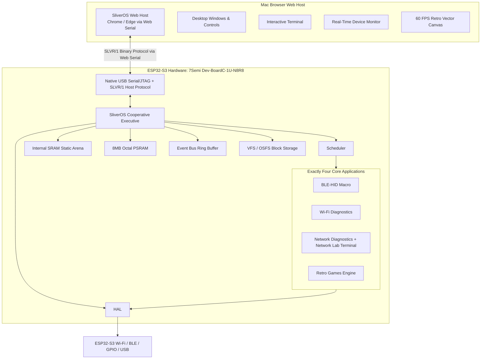
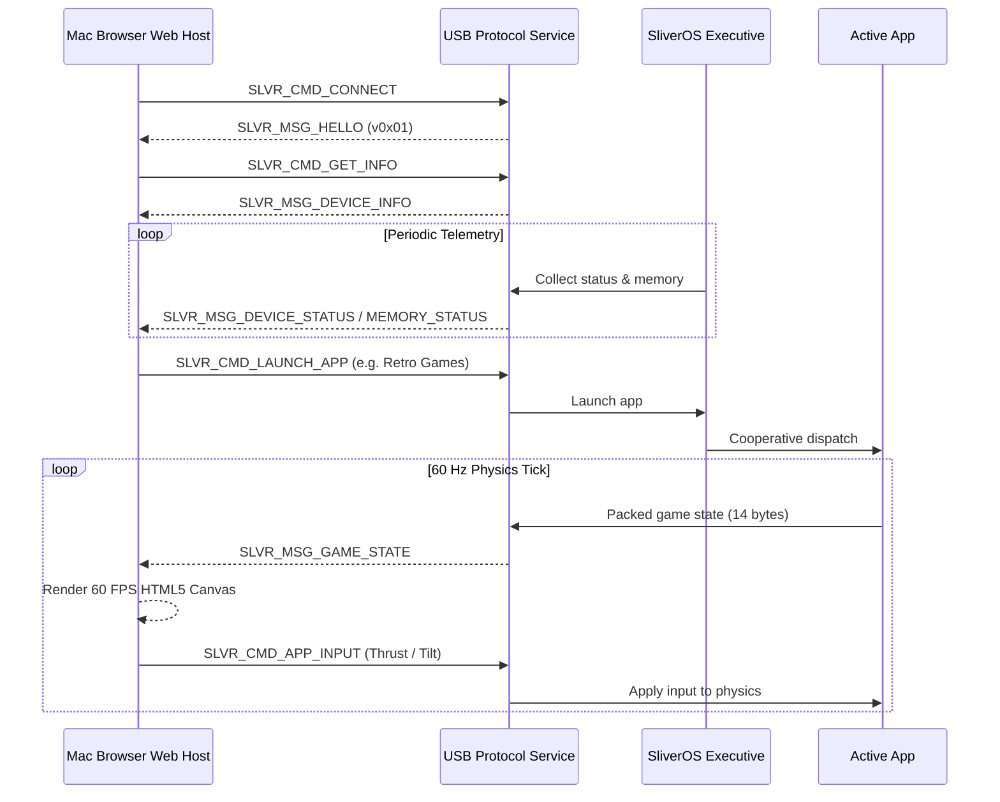

# SliverOS System Design

This document describes the SliverOS system architecture and host-interface model.

## High-Level Architecture



## Runtime Ownership

The ESP32-S3 owns embedded system execution. The Mac browser is the graphical display and host control console.



## Web Flasher & Web Host Integration

Both firmware installation and runtime interaction are unified within the SliverOS Web Host:

```text
NEW OR UNFLASHED HARDWARE
             │
             ▼
    Web Flasher Mode ──► Detect Chip ──► Verify Target ──► Flash Binaries ──► Hard Reset
                                                                                   │
                                                                                   ▼
                                                                       SliverOS Executive Boot
                                                                                   │
                                                                                   ▼
                                                                        SLVR/1 Protocol Handshake
                                                                                   │
                                                                                   ▼
                                                                         SliverOS Web Desktop
                                                              ┌────────────────────┼────────────────────┐
                                                              ▼                    ▼                    ▼
                                                        4 Core Apps       Developer Terminal     Device Monitor
```

## Network Lab Boundary

The Network Lab belongs inside the Network Diagnostics application so the project maintains exactly four application modules.

```text
Network Diagnostics
├── Target configuration
├── Bounded ICMP reachability checks
├── Bounded TCP service checks (22, 80, 443)
├── Wi-Fi passive metadata scan
├── Local authorized host discovery
└── Safe Terminal command parser (network_terminal.c)
    ├── help
    ├── status
    ├── wifi scan
    ├── network scan <authorized target>
    ├── port check <authorized host> <port>
    └── clear
```

The terminal is strictly bounded to authorized diagnostics. Credential harvesting, PMKID capture, deauthentication, password cracking, and attack automation are blocked by safety policy.

## Hardware & Validation Status

- **Target Hardware**: 7Semi ESP32-S3-Dev-BoardC-1U-N8R8 (8 MB Flash, 8 MB Octal PSRAM, Native USB Serial/JTAG).
- **Physical Display**: None required; zero SPI DMA framebuffer overhead.
- **Host Unit Tests**: 12/12 passing (100%).
- **Web Host Tests**: 15/15 passing (100%).
- **Physical Bench Matrix**: 25 points defined in `docs/HARDWARE_VALIDATION.md`, prepared for bench execution.
