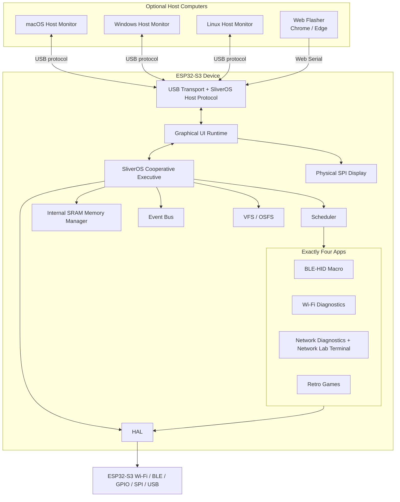
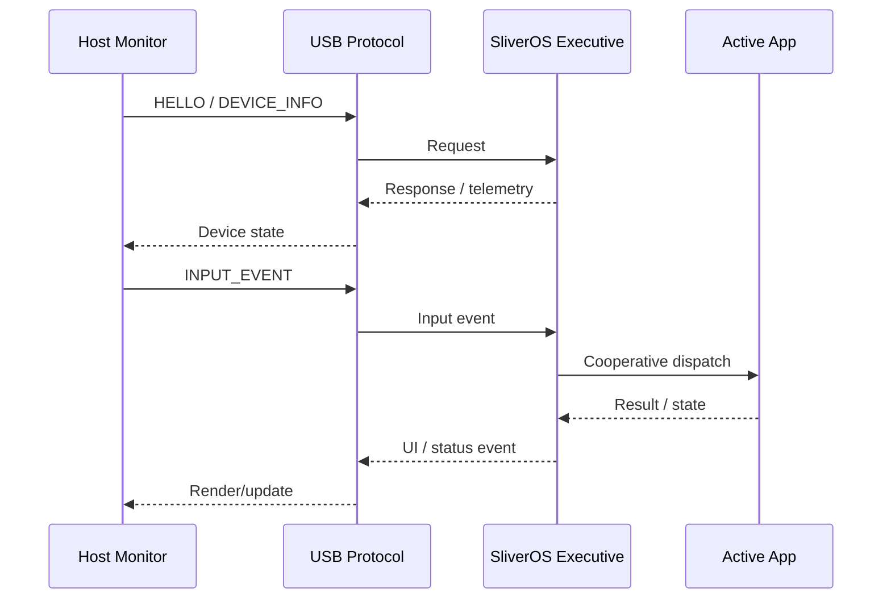

# SliverOS System Design

This document describes the current system boundary and the planned host-interface model.

## High-Level Architecture



## Runtime Ownership

The ESP32-S3 owns execution. The desktop host is optional.



## Web Flasher vs Host Monitor

These are separate products sharing the USB connection at different stages.

```text
NEW DEVICE
    │
    ▼
Web Flasher ──► Detect ──► Verify ──► Flash ──► Reboot
                                                   │
                                                   ▼
                                              SliverOS OS
                                                   │
                                  ┌────────────────┴────────────────┐
                                  ▼                                 ▼
                           Local SPI Display             Optional Host Monitor
                                                            │
                                              ┌─────────────┼─────────────┐
                                              ▼             ▼             ▼
                                           macOS         Windows        Linux
```

## Network Lab Boundary

The Network Lab belongs inside the existing Network Diagnostics application so the project keeps exactly four application modules.

Supported direction:

```text
Network Diagnostics
├── Target configuration
├── ICMP reachability
├── Bounded TCP service checks
├── Wi-Fi metadata scan
├── Local authorized host discovery
└── Terminal command interface
    ├── help
    ├── status
    ├── wifi scan
    ├── network scan <authorized target>
    ├── port check <authorized host> <port>
    └── clear
```

The terminal is intentionally bounded to authorized diagnostics and defensive lab use. Credential harvesting, PMKID capture, deauthentication, password cracking, exploitation automation, and unrestricted attack commands are outside the SliverOS feature boundary.

## Implementation Status

- ESP32-S3 cooperative executive: implementation in progress / hardening.
- Graphical launcher: implemented.
- Four application model: defined.
- Network terminal parser: foundation implemented.
- Web Flasher: online on Vercel; physical installation validation remains required.
- macOS/Windows/Linux Host Monitor: architecture defined; desktop implementation remains planned.
- Physical hardware validation: required before release readiness.
